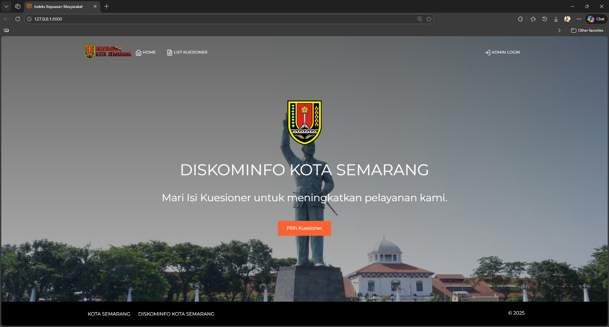

# Sistem Informasi Indeks Kepuasan Masyarakat (IKM)


This is a web-based Information System designed to track, manage, and analyze the **Community Satisfaction Index (Indeks Kepuasan Masyarakat)** for government services. The system allows citizens to submit feedback and helps administrators visualize satisfaction data.



## ✨ Key Features

Here are the main functionalities of the project:

### 👥 Public / User Side
- **Survey Submission:** Easy-to-use form for citizens to rate services.
- **Responsive Design:** Optimized for mobile and desktop viewing.
- **Anti-Spam Protection:** Integrated **Captcha** validation to prevent automated bot submissions before starting the questionnaire.
- **Real-time Validation:** Ensures data integrity during input.

### 🛡️ Admin Dashboard
- **Authentication:** Secure login system for administrators.
- **Data Visualization:** Charts and graphs showing satisfaction trends.
- **Survey Management:** CRUD (Create, Read, Update, Delete) functionality for survey questions.
- **Report Generation:** Export data to **PDF**  for official reporting.
- **Service Management:** Manage list of services/departments being rated.

## 🛠️ Built With

- **Framework:** [Laravel](https://laravel.com/)
- **Security:** [Mews Captcha](https://github.com/mewebstudio/captcha)
- **Frontend:** Bootstrap 5, Blade Templates
- **Language:** PHP 8.x
- **Database:** MySQL
- **Charts:** Chart.js

## 💻 Installation & Setup

Follow these steps to run the project locally:

1. **Clone the repository**
   ```bash
   git clone [https://github.com/username/repo-name.git](https://github.com/username/repo-name.git)
   cd repo-name
2. **Install dependencies**
   ```bash
   composer install
3. **Environment Setup Copy the .env file and generate the app key:**
   ```bash
   cp .env.example .env
   php artisan key:generate
4. **Database Configuration Open .env file and configure your database credentials:**
   ```bash
   DB_DATABASE=your_database_name
   DB_USERNAME=root
   DB_PASSWORD=
5. **Migrate and Seed**
   ```bash
   php artisan migrate --seed
6. **Run the Application**
   ```bash
   php artisan serve
   
Access the app at http://localhost:8000.

## 👤 Author
Fathan Muhammad Faqih
- LinkedIn
- GitHub

## 🙏 Acknowledgments
Special thanks to Sandhika Galih (Web Programming Unpas) for the comprehensive Laravel tutorials that helped build the foundation of this project.
